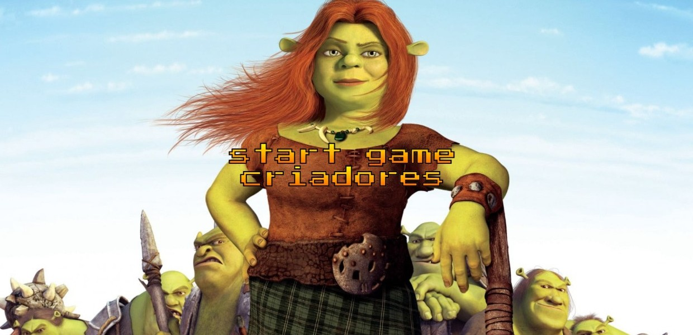
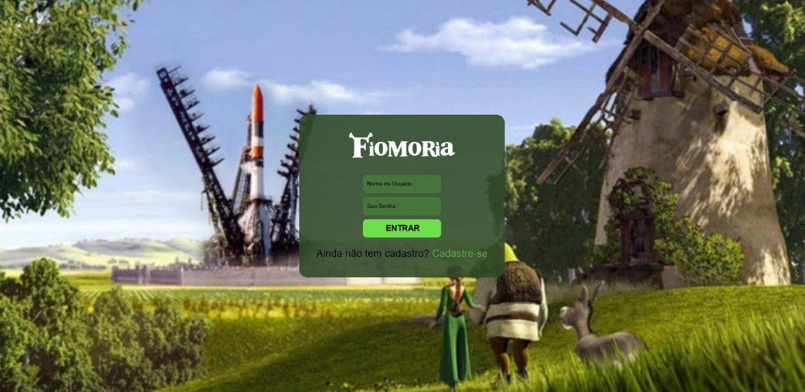
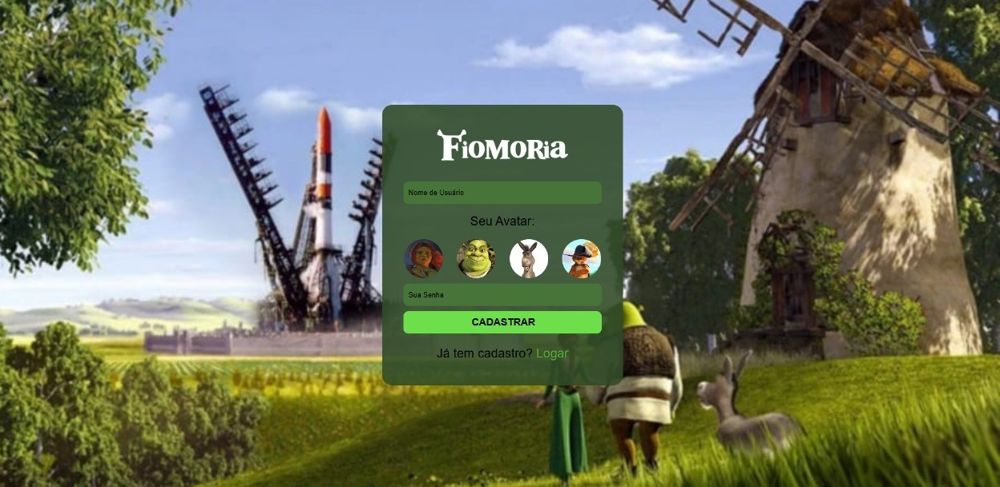
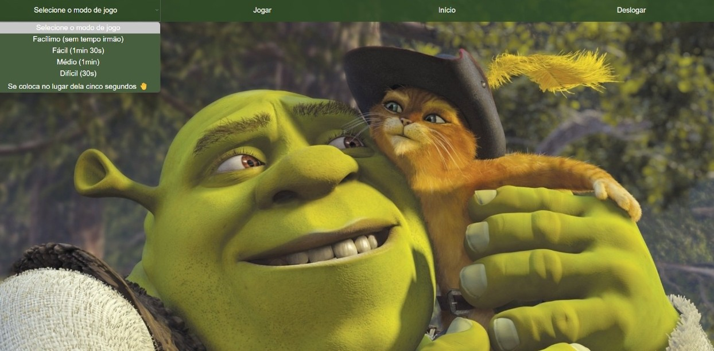
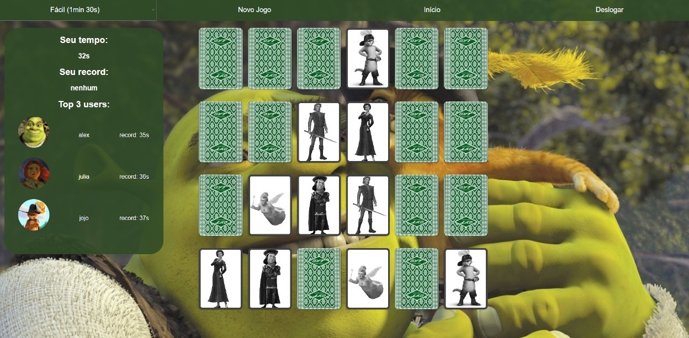
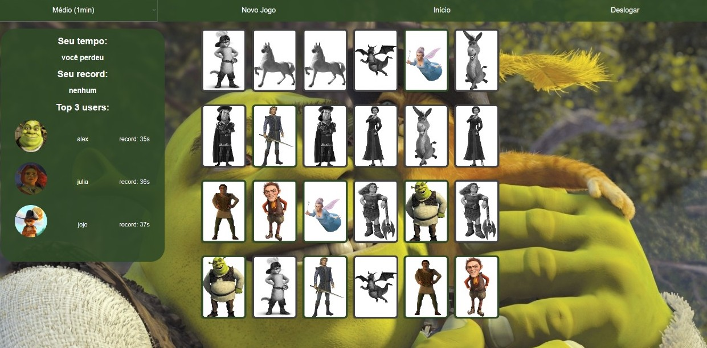
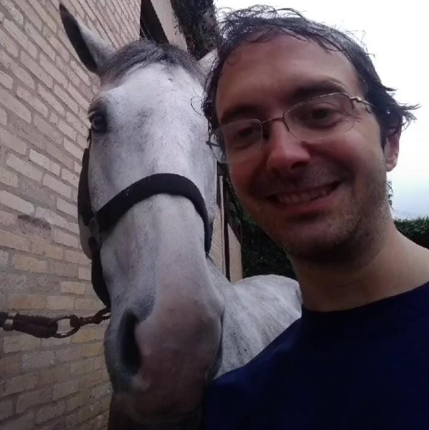

<h1 align="center" style="font-weight: bold;">Fiomoria 🧅</h1>

  
  
  
  
  

 <a href="#about">Sobre</a> • 
 <a href="#telas">Telas</a> •
 <a href="#jogo">Jogo</a> •
 

    <b>Um jogo da memória com o elenco de Shrek</b>

---

<h2 id="about">📖 Sobre</h2>

Fiomoria é um site de jogo da memória criado como projeto de estudo da matéria de Laboratório de Programação para Web.

Infelizmente o site **não está hospedado**, então só dá pra rodar localmente mesmo 😔.

---

<h2 id="telas">🖥️ Telas</h2>

### 🧅 Tela de Título

    

### 📜 Menu Inicial

    

### 🔐 Login e Cadastro

    
    

### 🎲 Jogo

    
    
    

---

<h2 id="jogo">🎮 O jogo</h2>

Antes de iniciar a partida, o usuário:

- Seleciona o nível de dificuldade por meio de um campo `<select>`, sendo que cada nível define um tempo específico para a conclusão da rodada;

- Clica em `Jogar` ou `Novo Jogo`, momento em que as cartas são embaralhadas e o jogo é iniciado.

Durante o jogo:

- Ao encontrar um par de cartas com imagens correspondentes, ambas permanecem viradas e recebem uma coloração cinza, indicando que o par foi corretamente identificado;

- O tempo restante é exibido e decresce conforme a rodada avança, de acordo com o nível de dificuldade escolhido;

- Se o tempo se esgotar antes que todos os pares sejam formados, as cartas restantes são automaticamente reveladas, permitindo ao jogador visualizar quais imagens ainda estavam ocultas.

📌 **Objetivo**: encontrar todos os pares antes do tempo acabar.

---

<h2 id="colab">🤝 Colaboradores</h2>

Um grande obrigado a todas as pessoas que contribuíram para este projeto.

<table>
  <tr>
    <td align="center">
      <a href="https://github.com/alexbeldam">
         
        <b>Alex</b>
      </a>
    </td>
    <td align="center">
      <a href="https://github.com/julia-sg">
         
        <b>Júlia</b>
      </a>
    </td>
    <td align="center">
      <a href="https://github.com/Geovanac5643">
         
        <b>Geovana</b>
      </a>
    </td>
  </tr>
</table>

<h2 id="honra">⭐ Menção Honrosa</h2>

E um grande obrigado ao professor que nos ensinou tudo e mais um pouco!

<table>
  <tr>
    <td align="center">
      <a href="https://github.com/daniel-hasan">
         
        <b>Professor Hasan</b>
      </a>
    </td>
  </tr>
</table>
